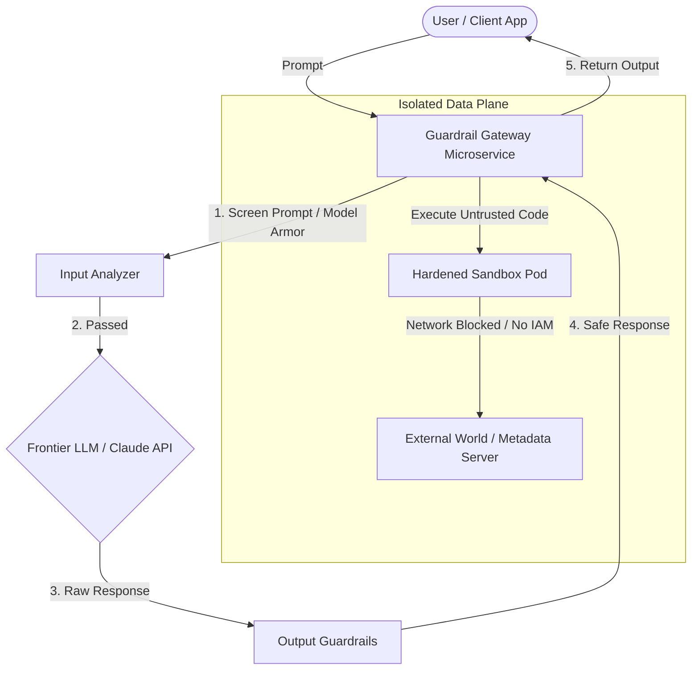

# Secure AI Sandbox & Guardrail Gateway (GCP + Terraform + Python)

[](https://www.terraform.io/)
[](https://www.python.org/)
[](https://cloud.google.com/)
[](https://kubernetes.io/)

A production-grade, security-first infrastructure and software template designed to deploy **isolated execution sandboxes** and **LLM guardrail gateways** for Generative AI applications. 

This repository showcases advanced patterns in **Infrastructure as Code (IaC)**, **Zero-Trust Cloud Networking**, **Kubernetes Isolation**, and **LLM Input/Output Safeguards** (incorporating conceptual model-armor screening and prompt injection mitigation).

---

## 🏗️ Architecture Overview

The architecture divides AI operations into two distinct, highly secured zones:

1. **The Guardrail Gateway (Control Plane)**: A hardened Python microservice running in GKE that intercepts all user prompts, screens them for malicious injection vectors, applies safety guardrails, sends requests to frontier LLMs (like Claude), and enforces output compliance before returning data.
2. **The Secure Execution Sandbox (Data Plane)**: Hardened, private Google Kubernetes Engine (GKE) namespaces utilizing network policies and restricted service accounts to run agent-generated code safely without risk of lateral network movement or resource abuse.



---

## 🔒 Key Security Features

* **Network Segmentation & VPC Service Controls**: Isolation of the GKE control plane and sandbox nodes inside a custom private VPC.
* **Metadata Server Protection**: Strict GKE Network Policies to block sandbox pods from querying the GCP Link-Local Metadata Server (`169.254.169.254`), preventing IAM credential extraction.
* **Prompt Injection Shield**: A Python-based layered screening pipeline featuring heuristics, keyword blocklists, and automated payload sanitization.
* **Least-Privilege Workload Identity**: Custom Google Service Accounts (GSA) mapped to Kubernetes Service Accounts (KSA) to strictly enforce minimal API permissions.

---

## 📂 Repository Structure

```text
├── terraform/
│   ├── main.tf          # Hardened VPC, GKE, and IAM Resource Definitions
│   ├── variables.tf     # Customizable Infrastructure Input Parameters
│   └── outputs.tf       # Clean Output Telemetry for CI/CD Pipelines
└── gateway/
    ├── app/
    │   ├── __init__.py
    │   └── gateway.py   # Python Guardrail & Prompt Protection Pipeline
    ├── Dockerfile       # Hardened, Non-Root Multi-Stage Docker Build
    └── requirements.txt # Python Dependencies
```

---

## 🚀 Quick Start & Deployment

### 1. Provision Infrastructure with Terraform
Navigate to the `terraform` directory, initialize, and apply the configuration:

```bash
cd terraform
terraform init
terraform apply -var="project_id=YOUR_PROJECT_ID"
```

### 2. Build and Push the Hardened Container
Build the non-root gateway image and push it to Google Artifact Registry (GAR):

```bash
cd ../gateway
docker build -t gcr.io/YOUR_PROJECT_ID/secure-ai-gateway:v1 .
docker push gcr.io/YOUR_PROJECT_ID/secure-ai-gateway:v1
```

### 3. Deploy to GKE
Apply the Kubernetes manifests (included in the sandbox configurations) to run the secure gateway and isolated pods.
